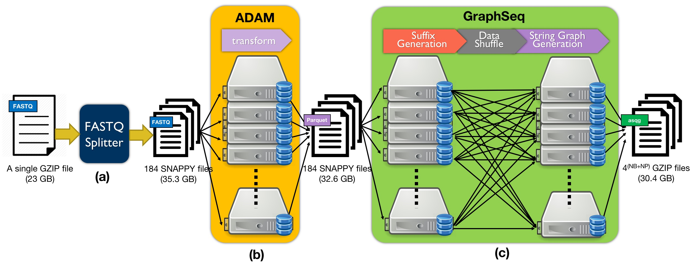

# GraphSeq - String Graph Construction on Spark
## Abstract
De novo genome assembly is an important application on both uncharacterized genome assembly and variant iden-tification in a reference-unbiased way. In comparison with de Brujin graph, string graph is a lossless data represen-tation for de novo assembly. However, string graph construction is computational intensive. We propose GraphSeq to accelerate string graph construction by leveraging the distributed computing framework.

## System Flow

## Usage

    /usr/local/spark/bin/spark-submit   --master spark://XXX:7077   --class com.atgenomix.seqslab.cli.SparkSTMain   ./target/graphseq-1.0.0.jar overlap
    INPUT                  : Input path (generated by Adam transform)
    OUTPUT                 : Output path
    -cache                 : Cache the reads in memory to speedup data processing
    -h (-help, --help, -?) : Print help
    -max_edges N           : Maximal number of edges per read [default = Integer.MAX_VALUE]
    -max_read_length N     : Maximal read length [default = 151]
    -mlcp N                : Minimal longest common prefix [default = 45]
    -packing_size N        : The number of reads will be packed together [default = 100]
    -pl_batch N            : Prefix length for number of batches [default=1]
    -pl_partition N        : Prefix length for number of partitions [default=7]
    -print_metrics         : Print metrics to the log on completion
    -profiling             : Enable performance profiling and output to $OUTPUT/STATS
    -rmdup                 : Remove duplication of reads
    -stats                 : Enable to output statistics of String Graph to $OUTPUT/STATS
